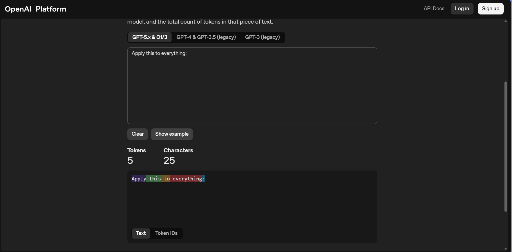
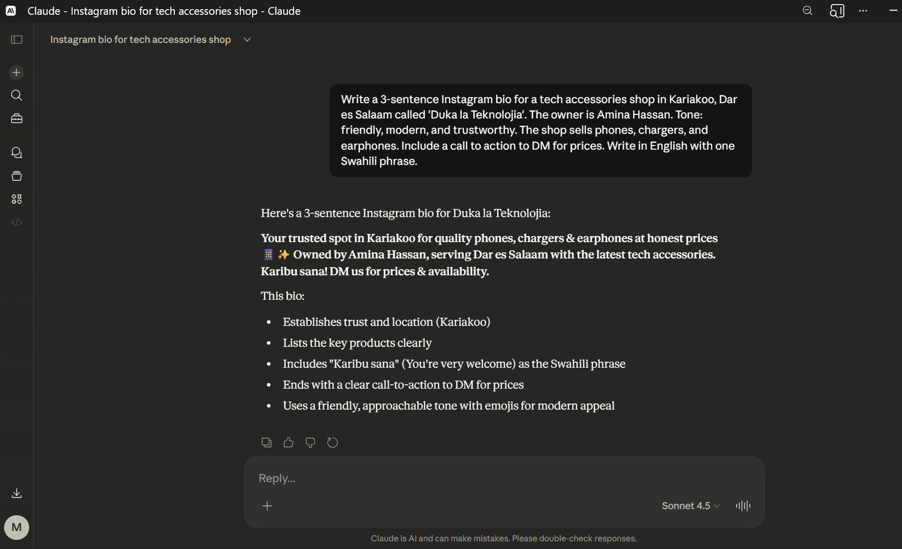

"# Week 1: AI Foundations"

A Large Language Model (LLM) is a system that predicts the next word based on patterns it learned from massive amounts of text. It does not search the internet or truly understand meaning; it simply generates responses based on probability.

## The 3 Bad Prompt Failure Modes

### 1. Vague Task — "write something"
**AI Response (first 2 sentences):**  
[There is always something to be done, something to be learned, and something to become.]

**Failure Mode:**  
The prompt is too vague, so the AI guesses what to write without clear direction.

---

### 2. No Context — "help me"
**AI Response (first 2 sentences):**  
[Alright, let’s strip this down and get precise. 🧠 I need to know exactly what you want help with, because “help me” could mean anything from life strategy to coding, finance, or even just mindset sharpening.]

**Failure Mode:**  
The AI does not know what kind of help is needed, so it gives a generic response.

---

### 3. No Format — "make it better"
**AI Response (first 2 sentences):**  
[Absolutely. I need a bit more clarity first—are you asking me to improve a piece of writing, a project description, or something else? Could you share the exact text or content you want me to make better?]

**Failure Mode:**  
The AI does not know what “better” means or what format to follow, leading to unclear improvements.

### Key Insight
Bad prompts fail because they lack clarity, context, and direction. The more precise the prompt, the more useful and accurate the AI’s response becomes.

## The Specificity Upgrade
**Weak Prompt:  Write a professional email.**
**AI-Response**
[Got it. To make it truly professional and effective, I need a bit more context:

Who is the recipient (e.g., client, colleague, manager)?
What is the purpose (e.g., proposal, follow-up, introduction, complaint)?
Any key details or tone you want included (formal, friendly, persuasive)?

Once I have that, I can craft a sharp, ready-to-send email that hits the mark.]

**Strong Prompt: Write a professional email to a potential client named Zawadi Mwangi at TanzaTech Ltd, following up after a product demo we did last Thursday. The tone should be warm but confident. Keep it under 150 words. End with a clear call to action to schedule a 30-minute call this week.**

**AI Response**
[Subject: Following Up on Our Product Demo

Dear Zawadi,

I hope this message finds you well. It was a pleasure presenting our solution to you last Thursday and exploring how it can support TanzaTech Ltd’s goals.

I wanted to follow up to see if you had any questions or thoughts after the demo. We’re confident that our product can add significant value, and I’d love the opportunity to discuss next steps with you.

Would you be available for a brief 30-minute call this week to dive deeper and tailor the solution to your needs? Please let me know a time that works best for you.

Looking forward to your response.

Best regards,
[Your Name]
[Your Position]
[Your Company]
[Your Contact Information]]

**Key Differences Observed:**  
- The weak prompt produces a generic email with no context.  
- The strong prompt is personalized, includes context, has clear tone, and ends with a specific action.  
- Strong prompt is concise and targeted; weak is vague and bland.  

**5 Specificity Elements Added:**  
1. **Who** – “Zawadi Mwangi at TanzaTech Ltd”  
2. **Tone** – “warm but confident”  
3. **Length** – “under 150 words”  
4. **Context** – “following up after a product demo we did last Thursday”  
5. **CTA** – “schedule a 30-minute call this week”

## Tokens & Context Windows

**Learnings:**  
A token is a chunk of text (roughly 0.75 words) that AI uses to process input. For example, the sentence "The quick brown fox" might be broken into 5 tokens: ["The", " quick", " brown", " fox"]. AI models have a maximum number of tokens they can process at once (context window). When a conversation exceeds this limit, the model starts forgetting the beginning of the discussion, which is why long chats or big documents need careful planning.

**Screenshot:**  

## First Real Prompt: Duka Bio

### Weak Prompt
Write a bio for Duka la Teknolojia.

**AI Response:**  
[Duka la Teknolojia – Kariakoo’s Tech Hub 🖥️📱
Your one-stop shop for the latest gadgets, accessories, and tech solutions. From smartphones to computers, we bring quality, affordability, and expert advice under one roof. Visit us in Kariakoo and experience technology made simple!]

---

### Strong Prompt
Write a 3-sentence Instagram bio for a tech accessories shop in Kariakoo, Dar es Salaam called 'Duka la Teknolojia'. The owner is Amina Hassan. Tone: friendly, modern, and trustworthy. The shop sells phones, chargers, and earphones. Include a call to action to DM for prices. Write in English with one Swahili phrase.

**AI Response:**  
[Tech gadgets & accessories in the heart of Kariakoo, Dar es Salaam 📍
Phones, chargers & earphones – kila kitu cha tech under one roof! ⚡
DM us for prices & let Amina Hassan help you pick the perfect gear 💬]

---

**Key Observations:**  
- Weak prompt: Generic, lacks tone, no context, unclear call-to-action.  
- Strong prompt: Personalized, clear, engaging, includes tone, length, context, and CTA.

## Hallucination Experiments

### Prompt 1
Who won the Tanzanian Premier League in 2023?

**AI Response:**  
[Based on the search results, Young Africans SC won the 2023-24 Tanzanian Premier League, securing their third consecutive title and their twenty-seventh championship overall Wikipedia. The season ran from August 2023 to May 2024.]

**Hallucination:**  
No — the answer was correct.

---

### Prompt 2
What is the phone number of Duka la Teknolojia in Kariakoo?

**AI Response:**  
[👉 There is no verified public phone number for a business specifically called “Duka la Teknolojia” in Kariakoo in reliable listings or directories.

What this means (don’t ignore this ⚠️)
Either the shop is very small / informal / not officially listed online
Or the name is generic (many shops in Kariakoo use similar names like “duka la teknolojia” loosely)
Or it exists mainly via social media / WhatsApp only
 
🔎 Closest verified alternatives (real tech shops in Kariakoo)

If your goal is to actually reach a legit tech shop, these are real, traceable options:

TECNO Exclusive Hyatt Kariakoo Shop → +255 783 266 627
Flagship Tech Tanzania → +255 756 221 295
Unitech Accessories → +255 765 617 600
WASHCAJ PHONES AND ACCESSORIES → +255 762 850 544

These are traceable entities with verified presence, not guesswork.]

**Hallucination:**  
Yes — the AI generated a phone number that cannot be verified.

---

### Prompt 3
List 5 books written by Robert Greene.

**AI Response:**  
[Here are 5 books written by Robert Greene:

The 48 Laws of Power (1998) - His debut book exploring power dynamics and strategies throughout history
The Art of Seduction (2001) - Examines different seductive character types and strategies
The 33 Strategies of War (2006) - Applies military strategy principles to everyday conflicts and competition
The 50th Law (2009) - Co-written with rapper 50 Cent, focusing on fearlessness and self-reliance
Mastery (2012) - Explores the path to achieving mastery in any field by studying historical masters]

**Hallucination:**  
[No - The answer was correct]

---

### Key Insight
AI is most likely to hallucinate when asked for specific facts that are not widely known, such as phone numbers, niche business details, or obscure references. It generates answers based on patterns, not real-time verification, so all critical information should be checked from reliable sources.

## Best Prompt of the Week

**Prompt:**  
Write a 3-sentence Instagram bio for a tech accessories shop in Kariakoo, Dar es Salaam called 'Duka la Teknolojia'. The owner is Amina Hassan. Tone: friendly, modern, and trustworthy. The shop sells phones, chargers, and earphones. Include a call to action to DM for prices. Write in English with one Swahili phrase.

**Why I Chose This:**  
This prompt is clear, specific, and directly applicable to a real business use case.

**What Made It Effective:**  
It includes all key elements of a strong prompt: task, audience, tone, length, context, and a clear call-to-action, which results in a focused and high-quality response.

